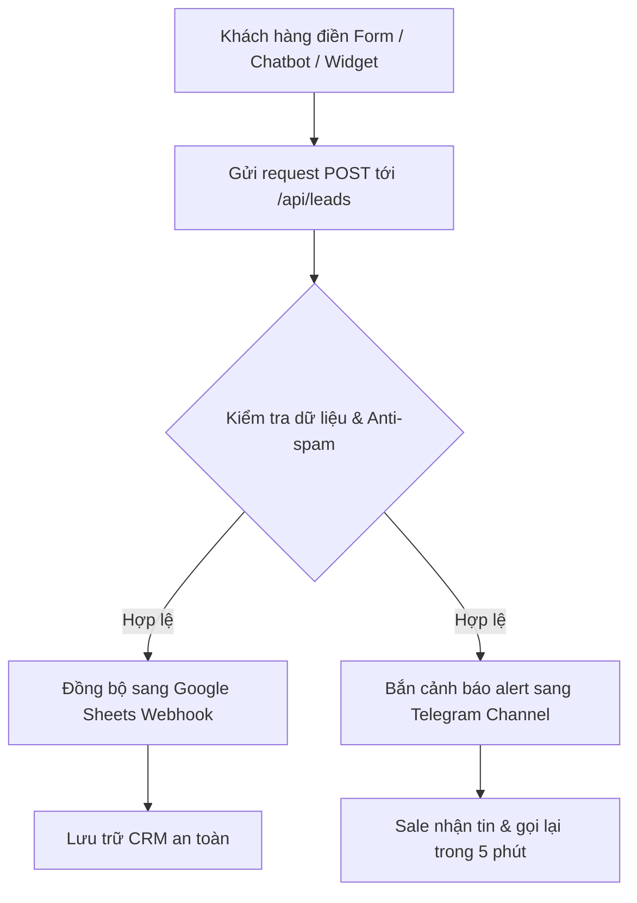

# Tài Liệu Bàn Giao Kỹ Thuật & Vận Hành — alexminh.com

Tài liệu này tổng hợp toàn bộ trạng thái kỹ thuật, luồng vận hành, kết quả kiểm thử chất lượng (QA) và các bước tiếp theo sau khi hệ thống **alexminh.com** được triển khai thành công lên môi trường Production.

---

## 1. Tổng Quan Dự Án (Project Overview)
Hệ thống **Alex Minh AI** là website thương mại dịch vụ chuyên nghiệp định hướng chuyển đổi cao, giúp các doanh nghiệp tại Thanh Hóa (Khách sạn du lịch Sầm Sơn, Spa/Nha khoa, Bất động sản, Trung tâm Giáo dục, OCOP Đặc sản) xây dựng Website, tích hợp Chatbot AI hỗ trợ tư vấn 24/7 và thiết lập hệ thống tự động hóa bán hàng (Automation).

---

## 2. Đường Dẫn Production (Production URL)
* **Tên miền chính thức**: [https://alexminh.com](https://alexminh.com)
* **Kênh chat Zalo hỗ trợ**: [https://zalo.me/0789284078](https://zalo.me/0789284078)
* **Hotline liên hệ**: **0789.284.078**

---

## 3. Công Nghệ Sử Dụng (Tech Stack)
* **Framework**: Next.js (App Router, Turbopack optimized)
* **Ngôn ngữ**: TypeScript
* **Styling**: Tailwind CSS
* **Nền tảng Hosting/Cloud**: Vercel Production Deployment
* **Tự động hóa & Tích hợp**: Google Apps Script (Spreadsheet) & Telegram Bot API

---

## 4. Danh Sách Trang Hoàn Thành (Pages Completed)
Hệ thống bao gồm 20 trang tĩnh và động đã được đóng gói tối ưu:
* `/` : Trang chủ đầy đủ 14 phân mục bán hàng.
* `/dich-vu` : Chi tiết 4 gói dịch vụ cốt lõi (Web, Chatbot, Automation, Content).
* `/demo-chatbot-ai` : Không gian trải nghiệm trực quan giả lập kịch bản AI cho 5 ngành chính.
* `/du-an-mau` : Showcase các dự án mẫu (Case Studies) thực tế chi tiết tại Thanh Hóa.
* `/bang-gia` : Chi tiết các gói chi phí từ Web uy tín đến Hệ thống AI Sales.
* `/blog` : Trang chia sẻ kiến thức công nghệ và marketing địa phương.
* `/lien-he` : Trang tiếp nhận yêu cầu tư vấn và thông tin doanh nghiệp.
* `/blog/[slug]` : Hệ thống 5 bài viết chuyên sâu tối ưu SEO:
  1. `/blog/thiet-ke-website-doanh-nghiep-thanh-hoa`
  2. `/blog/chatbot-ai-khach-san-sam-son`
  3. `/blog/chatbot-ai-spa-nha-khoa-thanh-hoa`
  4. `/blog/website-chatbot-ai-bat-dong-san-thanh-hoa`
  5. `/blog/doanh-nghiep-thanh-hoa-ung-dung-ai-tu-dau`

---

## 5. Luồng Đăng Ký & Thu Thập Thông Tin (Lead Capture Flow)

* **Điểm tiếp nhận (Entry points)**:
  * Form đăng ký tại chân Trang chủ và chân trang `/lien-he`.
  * Trình giả lập Chatbot tại `/demo-chatbot-ai`.
  * Nút floating liên hệ nhanh / Zalo / Hotline.
* **Xử lý trung gian (`/api/leads`)**:
  * Chống spam bằng cơ chế giới hạn tần suất (Rate Limiting) theo IP.
  * Tích hợp bẫy bot spam (Honeypot field).
  * Chuẩn hóa và validate số điện thoại Việt Nam (10 chữ số, bắt đầu bằng các đầu số di động hợp lệ).
* **Lưu trữ dữ liệu (Google Sheets)**:
  * Đẩy thông tin qua webhook URL kết nối trực tiếp với Google Apps Script của khách hàng.
* **Thông báo thời gian thực (Telegram alert)**:
  * Gọi Telegram Bot API đẩy thông báo lead mới ngay lập tức dạng tin nhắn văn bản cấu trúc rõ ràng.

---

## 6. Biến Môi Trường Cần Thiết Trên Production (Required Env Variables)
Các biến sau cần được thiết lập chính xác trên Vercel Dashboard của dự án:

| Tên biến | Kiểu dữ liệu | Mô tả / Giá trị mẫu |
|---|---|---|
| `GOOGLE_SHEET_WEBHOOK_URL` | URL | Link webhook Google Apps Script nhận dữ liệu Lead. |
| `GOOGLE_SHEET_WEBHOOK_SECRET` | Chuỗi ký tự | Mã xác thực an toàn gửi cùng request đến Sheets. |
| `TELEGRAM_BOT_TOKEN` | Token | Token bảo mật của Bot Telegram quản lý lead. |
| `TELEGRAM_CHAT_ID` | Số / ID | ID nhóm hoặc kênh nhận cảnh báo lead mới. |
| `NEXT_PUBLIC_SITE_URL` | URL | `https://alexminh.com` (Dành cho sitemap và SEO canonical). |
| `NEXT_PUBLIC_GA_ID` | ID | ID Google Analytics 4 (Ví dụ: `G-FXRRDM3VWW`). |

---

## 7. Tóm Tắt Kết Quả Kiểm Thử (QA Summary)
* **Local Lint & Build**: **PASS** (Không có lỗi TypeScript, ESLint hay lỗi biên dịch static pages).
* **Kiểm tra Production Routes**: **PASS** (100% các trang chính và bài viết blog phản hồi HTTP `200 OK`).
* **Kiểm tra Google Sheets**: **PASS** (Đồng bộ thành công qua webhook, lưu đúng hàng/cột).
* **Kiểm tra Telegram Alert**: **PASS** (Nhận thông báo tức thì, hiển thị chuẩn font tiếng Việt không lỗi ký tự).
* **Kiểm tra Responsive**: **PASS** (Thiết kế responsive thích ứng tốt từ màn hình desktop 4K đến điện thoại di động siêu nhỏ).
* **Sitemap & Robots**: **PASS** (Đầy đủ URL chuẩn cấu trúc, liên kết chính xác).

---

## 8. Các Lỗi Quan Trọng Đã Được Khắc Phục (Important Fixed Issues)
* **Định dạng số điện thoại (Phone Validation)**: Sửa đổi bộ lọc regex để chấp nhận chính xác các định dạng SĐT Việt Nam, đồng thời tự động loại bỏ khoảng trắng, dấu chấm, dấu gạch ngang trước khi validate.
* **Active Navigation cho Blog con**: Sửa lỗi menu điều hướng không hiển thị trạng thái active khi người dùng truy cập các bài viết chi tiết có đường dẫn `/blog/[slug]`.
* **Auto-Scroll của Chatbot**: Loại bỏ hành vi tự động kéo cuộn toàn bộ màn hình trình duyệt (window scroll) khi có tin nhắn mới hoặc khi click câu hỏi mẫu; thay thế bằng cơ chế cuộn nội bộ bên trong khung chat.
* **Đồng bộ Hotline**: Thay thế và đảm bảo toàn bộ số hotline hiển thị và liên kết gọi điện đồng nhất là **0789.284.078** (`tel:0789284078`).

---

## 9. Hướng Dẫn Vận Hành Hệ Thống (Operating Checklist)
1. **Kiểm tra Google Sheet hàng ngày**: Theo dõi danh sách lead được cập nhật tự động để phát hiện các trường hợp bị trùng lặp hoặc bỏ sót.
2. **Theo dõi thông báo Telegram**: Cài đặt thông báo ưu tiên cho Kênh/Nhóm nhận lead để kịp thời gọi lại tư vấn khách hàng trong vòng 5 phút (tối ưu tỷ lệ chốt đơn).
3. **Giám sát Search Console**: Đăng ký sitemap (`/sitemap.xml`) lên Google Search Console để Google lập chỉ mục nhanh chóng cho các bài viết.
4. **Giám sát GA4**: Theo dõi lưu lượng truy cập từ Thanh Hóa, tỷ lệ click xem demo chatbot và tỷ lệ gửi form để tối ưu giao diện theo thời gian.
5. **Sao lưu dữ liệu định kỳ**: Thực hiện xuất hoặc sao lưu bảng tính Google Sheets sang file Excel dự phòng hàng tuần để tránh mất mát dữ liệu ngoài ý muốn.

---

## 10. Kế Hoạch Tiếp Theo (Next Phase)
### **Phase 3.0 — Sales Sprint: Tiếp Cận 50 Doanh Nghiệp Tiềm Năng Đầu Tiên tại Thanh Hóa**
* Lập danh sách 50 khách hàng mục tiêu thuộc các nhóm: Spa/Nha khoa tại TP. Thanh Hóa, Khách sạn homestay tại Sầm Sơn, đại lý Bất động sản và các hộ kinh doanh nem chua/OCOP lớn.
* Thực hiện gửi link trải nghiệm Demo Chatbot chuyên biệt theo đúng ngành nghề để chốt hợp đồng.
* Triển khai cổng kết nối webhook thực tế sang hệ thống quản lý CRM hoặc Google Sheets tùy biến của từng khách hàng sau khi ký kết.
